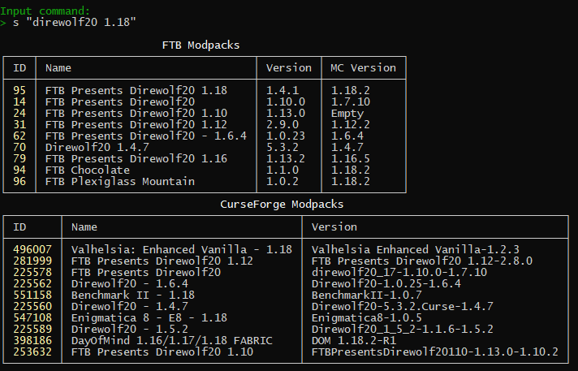
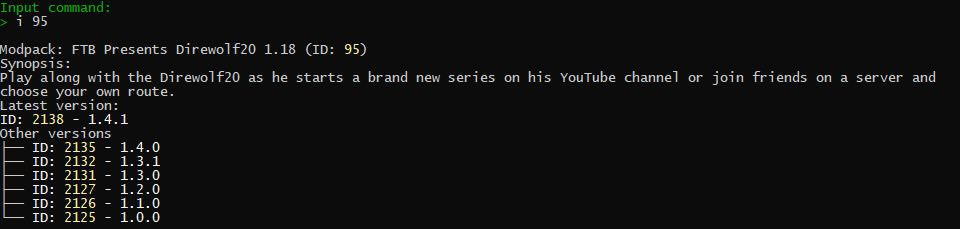

# ModpacksCH

Console application for downloading modpacks from modpacks.ch

## Usage

```console
ModpacksCH [command] [options]

Options:
  -?, -h, --help  Show help and usage information

Commands:
  s, search <name>                     Search modpacks by name
  i, info <modpackID>                  Show info about modpack
  d, download <modpackID> <versionID>  Download modpack
```

* Find modpackID using search command or on [modpack page](https://feed-the-beast.com/modpack)  
* Use info command to see info about modpack
* Download modpack using modpackID (Latest version without versionID)
* note.txt contains Forge version and recommended memory

Running without arguments will launch in interactive mode

Search command result



Info command result


